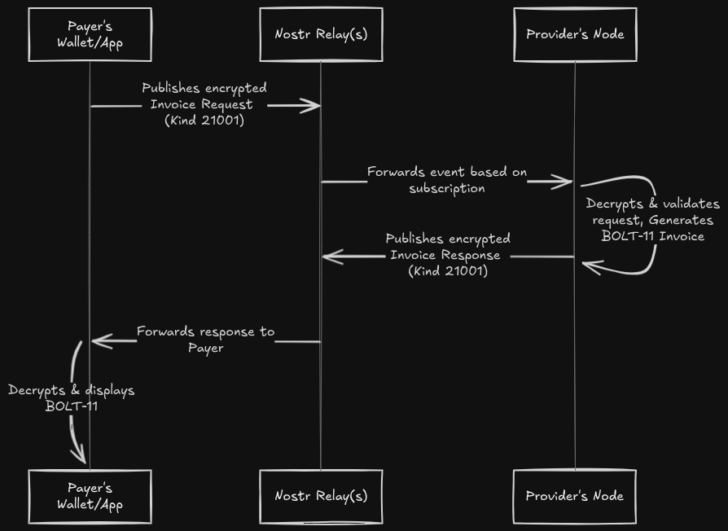

# CLINK: Common Lightning Interface for Nostr Keys

CLINK defines Nostr-native standards for Lightning Network interactions, leveraging the protocol's built-in transport, identity, and encryption. This enables secure communication between Lightning nodes, wallets, and applications without traditional web infrastructure dependencies while also remaining web-friendly and facilitating self-custody. This novel use of Nostr delivers a greatly enhanced user experience and unlocks new use-cases versus the status quo of things like LNURL, Bolt12, and NWC.

- [About](#about)
- [CLINK vs NWC](#clink-vs-nwc)
- [Specifications](#specifications)
- [Event Kinds](#event-kinds)
- [Ecosystem](#ecosystem)
- [Contributing](#contributing)

## About

CLINK provides standardized, **Nostr-native** methods for common Lightning interactions. By building directly on Nostr's capabilities, it enables secure integration between Lightning applications and node services without compromising sovereignty.

Current Lightning interaction methods have a number of pitfalls. Some require maintaining traditional web infrastructure, adding undue complexity to self-hosting that results in custodial solutions. Others introduce friction and security risks through pre-shared secrets, or depend on slow and unreliable onion messages that are impractical for web applications.

CLINK leverages Nostr's native strengths to enable direct, identity-driven interactions between Lightning nodes and applications:

*   **Simplify User Experience:** Enable direct, spontaneous interactions compatible with familiar Nostr identifiers (e.g., NIP-05 addresses).
*   **Reduce Infrastructure Dependency:** Operate entirely over the Nostr network where desired, eliminating the need for traditional web infrastructure.
*   **Enhance Security & Leverage Web-of-Trust:** Utilize Nostr's cryptographic identity and signed events for establishing connections and authorizing actions.
*   **Foster a Native Ecosystem:** Provide standardized protocols built *for* Nostr, enabling tighter integration between Lightning and Nostr-powered applications.

## CLINK vs NWC

While NWC also utilizes Nostr for transport, it specifically targets **wallet remote control** modeled after the RPC pioneered by Lightning.Pub and ShockWallet to provide a Nostr-tunneled API.

CLINK, conversely, defines **interactive protocols** using Nostr's wider range of capabilities such as identity and ad-hoc messaging that **enable direct application-service and peer-to-peer relationships**. This includes:
1.  **Service Interactions:** Providing specifications like `CLINK Offers` for invoice requests – functionality *not* covered by NWC.
2.  **Payment Workflows:** Defining protocols like `CLINK Debits` for event-driven payment requests and authorization.

This comprehensive and protocol-based approach facilitates a more integrated architecture for applications communicating directly over Nostr for diverse Lightning tasks. It enables enhanced security models tied to Nostr identity while maintaining compatibility with traditional web application architectures.

Where NWC is deferential to LNURL and scoped for a specific task, **CLINK is fundamentally committed to Nostr as the foundation for the next generation of decentralized Lightning applications.**

## Specifications

- [CLINK Offers](specs/clink-offers.md): Static payment codes (`noffer1...`) analogous to LNURL-Pay but entirely Nostr-native. Enables invoice generation via Nostr direct messages without a publicly accessible HTTPS endpoint. Services like Lightning.Pub can trigger webhooks on offer events for easy integration while maintaining self-custody.
- [CLINK Debits](specs/clink-debits.md): Static authorization pointers (`ndebit1...`) for direct, secure payment requests between parties via key-based identity and event-based authorization flows.
- [CLINK Manage](specs/clink-manage.md): Delegated management (`nmanage1...`), e.g., external apps managing offers for a user.

## Event Kinds

| kind   | description                | spec                                     |
|--------|----------------------------|------------------------------------------|
| 21001  | Offer Request/Response     | [CLINK Offers](specs/clink-offers.md)    |
| 21002  | Debit Request/Response     | [CLINK Debits](specs/clink-debits.md)    |
| 21003  | Management Delegation      | [CLINK Manage](specs/clink-manage.md)    |

## Ecosystem

| Project      | Type    | Supports        | Features / Notes |
|--------------|---------|----------------|------------------|
| [Lightning.Pub](https://lightning.pub) | Server  | Offers, Debits | Reference server for wallets. |
| [ShockWallet](https://shockwallet.app) | Wallet  | Offers, Debits | Pay offers and manage your offers and requests via Lightning.Pub. |
| [Zeus Wallet](https://zeusln.com) | Wallet  | Offers | Pay offers, ZEUS Pay users get an offer by default. |
| [Bridgelet](https://github.com/shocknet/bridgelet) | Bridge  | Offers         | Simple NIP-05, LNURL and Lightning Address bridge for your custom domain, uses Offers to fetch invoices from your node. |
| [CLINK SDK](https://www.npmjs.com/package/@shocknet/clink-sdk) | SDK     | Offers, Debits | JS/TS library for CLINK integration. |
| [Stacker.News](https://stacker.news) | Message Board | Offers, Debits | Attach a wallet via CLINK to send and receive zaps. |
| [clinkme.dev](https://clinkme.dev) | Web Demo | Offers, Debits | Demo of a static website using CLINK Offers. |
| [bxrd.app](https://bxrd.app) | Nostr Client | Offers, Debits | A graph-based Nostr Client with Debit integration for Zaps. |
| *Your project here* | - | - | PR welcome! |

## Contributing

CLINK specifications aim to standardize common Lightning interactions over Nostr. To propose changes or additions:

1. **Implementation First**: New specifications should demonstrate working implementations.
2. **Backwards Compatible**: Changes must not break existing implementations.
3. **No Redundancy**: There should be no more than one way of doing the same thing.
4. **Nostr Native**: Specifications should leverage Nostr's inherent capabilities (identity, events, encryption).

### Process

1. **Discussion**: Open an issue to discuss the proposed change/addition
2. **Implementation**: Develop and test the feature
3. **Documentation**: Submit a PR with specification updates
4. **Review**: Community feedback and refinement
5. **Acceptance**: Merge when consensus is reached

## License

All CLINK specifications are public domain.
